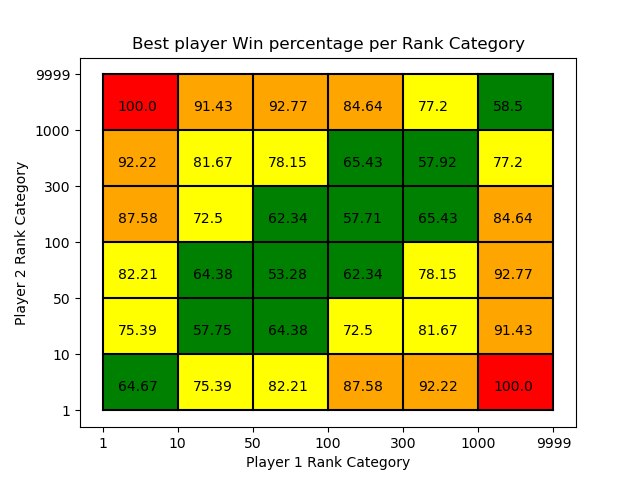
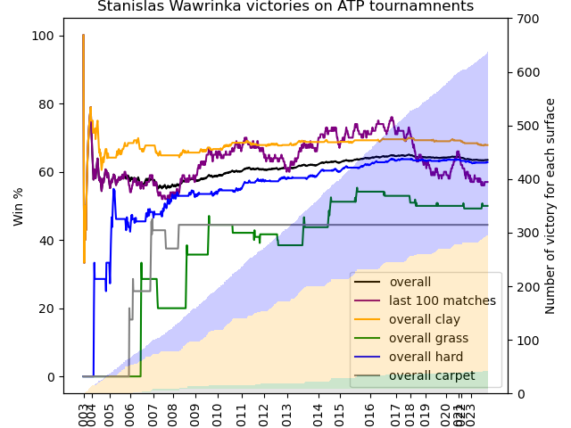
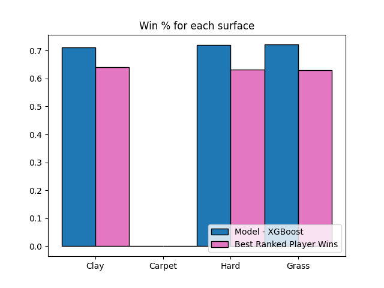

# Tennis-Prediction Repository

The goal of this project is to predict the outcome of a tennis match using the data of both players.
The data used comes from https://github.com/JeffSackmann.

## Installation

To clone the repository, with the data you need to also clone the submodules:

```bash
git clone --recurse-submodules https://github.com/VincentAuriau/Tennis-Prediction.git
```

## Usage

You can find examples in /examples:

### Loading players statistics at match time + match outcome

```python
from data.data_loader import matches_data_loader
data_df = matches_data_loader(path_to_data="submodules/tennis_atp")
```
data_df contains let you access information about players (statistics prior to the match) along statistics of the match.
A basic example statistic: the victory percentage of the best ranked player in a match, depending on players rankings.


Number of ATP main matches depending on players rank             |  Victory % of best ranked player
:-------------------------:|:-------------------------:
 |  

It can be easily used to also compute players statistics over their carreer, and/or at match time. Here is a simple example with Stan Wawrinka:
Stan's Victory % in main ATP matches             |  Stan's career aces % diff with adversary
:-------------------------:|:-------------------------:
 |  

### Train/Testing on matches outcome:

```python
from sklearn.ensemble import RandomForestClassifier
from evaluation.train_test import train_test_evaluation

test_score = train_test_evaluation(
    train_years=[2020, 2021],
    test_years=[2022, 2023],
    model_class=RandomForestClassifier,
    model_params={"n_estimators": 2000, "max_depth": None},
    match_features=[],
    player_features=["Ranking"],
    encoding_params={},
    additional_features=[],
    save_path="./results",
    save_all_results=False
)

print("Test Score", test_score)
```

Models and hyperparamters can easily be compared with the file results.csv saved in save_path.

Different models performances
:-------------------------:


If the argument save_all_results is set to True, the whole csv of test data is saved. It helps to get more in-depth analysis of results

Model precision compared with best ranked player wins strategy            |  Model precision depending of players ranks
:-------------------------:|:-------------------------:
 |  