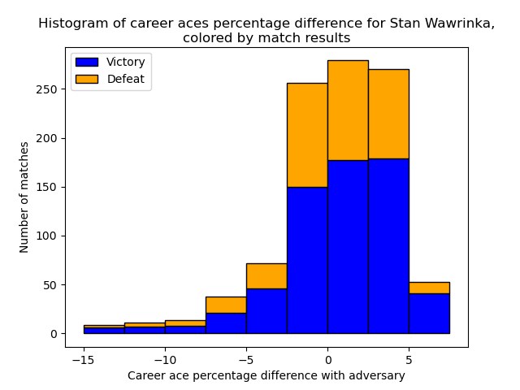
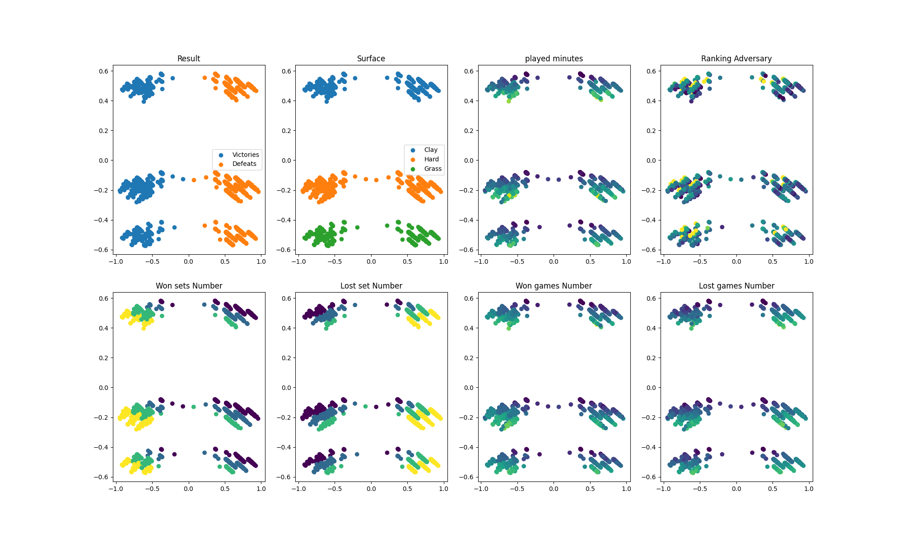

# Tennis-Prediction


The goal of this project is to predict the outcome of a tennis match using the data of both players and ML models.\
The data used comes from [Jeff Sackmann's repository](https://github.com/JeffSackmann).

- [Installation](#installation)
- [Usage](#usage)
  - [Data Loading](#data-loading)
  - [Machine Learning modelling](#ml-modelling)
  - [Encoding Matches](#encoding-matches)
- [License](#license)

## Installation

To clone the repository, with the data you need to also clone the submodules:

```bash
git clone --recurse-submodules https://github.com/VincentAuriau/Tennis-Prediction.git
```

## Usage

You can find examples in /examples:

### Data Loading
Loading players statistics at match time and match outcome:
[Example](examples/data/data_loading.py)

```python
from data.data_loader import matches_data_loader
data_df = matches_data_loader(path_to_data="submodules/tennis_atp")
```
data_df contains let you access information about players (statistics prior to the match) along statistics of the match.
A basic example statistic: the victory percentage of the best ranked player in a match, depending on players rankings.


Number of ATP main matches depending on players rank             |  Victory % of best ranked player
:-------------------------:|:-------------------------:
 |  

It can be easily used to also compute players statistics over their carreer, and/or at match time. Here is a simple example with Stan Wawrinka:
Stan's Victory % in main ATP matches             |  Stan's career aces % diff with adversary
:-------------------------:|:-------------------------:
 |  

Here is an example of a data row:

| id | tournament    | tournament_level    | tournament_date    | tournament_surface    | round    | best_of    | match_id    | Winner | Score |
| :---:   | :---: | :---: | :---:   | :---: | :---: | :---:   | :---: | :---:   | :---: |
| atp_matches_qual_chall_2003_5427 | San Benedetto CH   | C   | 20030811   | Clay   | SF   | 3   | 20030811   | 0 | 2-6 7-5 7-5 |

<ins>Base Match Statistics:</ins>
- **id and match_id:** unique identification of the matches
- **tournament:** name of the tournament
- **tournament_level:** Category of the tournament 'G' (Grand Slams) 'M' (Masters 1000s), 'A' (other tour-level events), 'C' (Challengers), 'S' (Satellites/ITFs), 'F' (Tour finals), 'D'( Davis Cup)
- **tournament_date:** date
- **tournament_surface:** surface 'Grass', 'Clay', 'Carpet', 'Hard'
- **round:** tournament round of the match 'F' (finale), 'SF' (semi-finale),
- **best_of:** number of won games needded (3 or 5)
- **Winner:** index of the winner: 0 (Player1) or 1 (Player2)
- **Score:** finale score
   
<ins>Additional match statistics:</ins>
- **elapsed_minutes:** Duration of the match
- **aces_nb_x:** Number of aces of player x
- **doublefaults_nb_x:** Number of doublefaults
- **svpt_x:** Number of serve points
- **1stIn_1:** Number of first serves made
- **1stWon_1:** Number of first-serve points won
- **2ndWon_x:** Number of second-serve points won
- **SvGms_1:** Number of serve games
- **bpSaved_1:** Number of break points saved
- **bpFaced_1:** Number of break points faced

<ins>Example of match statistics:</ins>

| Name_1 | ID_1    | Ranking_1    | Ranking_Points_1    | Ranking_History_1    | Best_Rank_1    | Birth_Year_1    | Versus_1    | Hand_1 | Last_Tournament_Date_1    | Height_1    | Matches_1    | Matchs_Clay_1    | Matches_Carpet_1    | Matches_Grass_1    | Matches_Hard_1    | Victories_Percentage_1    | Clay_Victories_Percentage_1    | Carpet_Victories_Percentage_1    | Grass_Victories_Percentage_1    | Hard_Victories_Percentage_1    | Aces_Percentage_1    | Doublefaults_Percentage_1    | First_Save_Success_Percentage_1    | Winning_on_1st_Serve_Percentage_1    | Winning_on_2nd_Serve_Percentage_1    | Overall_Win_on_Serve_Percentage_1    | BreakPoint_Face_Percentage_1 | BreakPoint_Saved_Percentage_1 | last_rankings_1 | last_ranking_points_1 |
| :---:   | :---: | :---: | :---:   | :---: | :---: | :---:   | :---: | :---:   | :---: | :---: | :---:   | :---: | :---: | :---:   | :---: | :---:   | :---: | :---: | :---:   | :---: | :---: | :---:   | :---: | :---:   | :---: | :---: | :---:   | :---: | :---:   | :---: |
| Stan.Wawrinka | 104527  | 184   | 114   | {20030616: [387, 68], 20030707: [363, 74], 20030714: [348, 79], 20030721: [303, 99], 20030811: [284, 114]}   | 284   | 19850328   | []   | R | 20030721 | 183 | [['V', 'atp_matches_qual_chall_2003_3466'], ['D', 'atp_matches_qual_chall_2003_3481'], ['D', 'atp_matches_2003_4049'], ['V', 'atp_matches_2003_4315'], ['D', 'atp_matches_2003_4328'], ['V', 'atp_matches_2003_4773'], ['D', 'atp_matches_2003_4782'], ['V', 'atp_matches_qual_chall_2003_5408'], ['V', 'atp_matches_qual_chall_2003_5419'], ['V', 'atp_matches_qual_chall_2003_5424']] | ['V', 'D', 'D', 'V', 'D', 'V', 'D', 'V', 'V', 'V'] | [] | [] | [] | 60 | 60 | 0 | 0 | 0 | 3.41880341880342 | 4.27350427350427 | 64.957264957265 | 54.985754985755 | 15.6695156695157 | 70.6552706552707 | 11.3960113960114 | 7.69230769230769 | [303, 9999, 9999, 9999, 9999, 9999, 9999, 9999, 9999, 9999, 9999, 387] | [99, 0, 0, 0, 0, 0, 0, 0, 0, 0, 0, 68] |


| Name_2 | ID_2 | Ranking_2 | Ranking_Points_2 | Ranking_History_2 | Best_Rank_2 | Birth_Year_2 | Versus_2 | Hand_2 | Last_Tournament_Date_2 | Height_2 | Matches_2 | Matchs_Clay_2 | Matches_Carpet_2 | Matches_Grass_2 | Matches_Hard_2 | Victories_Percentage_2 | Clay_Victories_Percentage_2 | Carpet_Victories_Percentage_2 | Grass_Victories_Percentage_2 | Hard_Victories_Percentage_2 | Aces_Percentage_2 | Doublefaults_Percentage_2 | First_Save_Success_Percentage_2 | Winning_on_1st_Serve_Percentage_2 | Winning_on_2nd_Serve_Percentage_2 | Overall_Win_on_Serve_Percentage_2 | BreakPoint_Face_Percentage_2 | BreakPoint_Saved_Percentage_2 | last_rankings_2 | last_ranking_points_2 |
| :---:   | :---: | :---: | :---:   | :---: | :---: | :---:   | :---: | :---:   | :---: | :---: | :---:   | :---: | :---: | :---:   | :---: | :---:   | :---: | :---: | :---:   | :---: | :---: | :---:   | :---: | :---:   | :---: | :---: | :---:   | :---: | :---:   | :---: |
| Martin.Vassallo Arguello | 103506 | 125 | 296 | {19990201: [817, 13], 20000710: [398, 61], 20000731: [354, 75], 20000807: [377, 70], 20010625: [459, 48], 20010709: [405, 61], 20010813: [391, 68], 20010820: [374, 72], 20010827: [342, 88], 20010917: [291, 117], 20010924: [286, 122], etc...} | 123 | 19800210 | []   | R | 20030804 | 183 | [['V', 'atp_matches_qual_chall_1999_380'], ['D', 'atp_matches_qual_chall_1999_393'], ['V', 'atp_matches_qual_chall_2000_3972'], ['V', 'atp_matches_qual_chall_2000_3988'], ['D', 'atp_matches_qual_chall_2000_3996'], ['D', 'atp_matches_qual_chall_2000_4725'], ['D', 'atp_matches_qual_chall_2000_4758'], ['V', 'atp_matches_qual_chall_2001_3699'], etc...] | ['V', 'D', 'V', 'V', 'D', 'V', 'V', 'D', 'V', 'V', 'D', 'V', 'D', 'V', 'V', 'D', 'V', 'V', 'V', 'D', 'V', 'D', 'V', 'V', 'V', 'V', 'D', 'D', 'V', 'V', 'V', 'D', 'V', 'D', 'V', 'D', 'D', etc...] | ['D', 'V', 'D', 'V', 'D'] | ['D'] | ['D', 'D', 'D', 'V', 'V', 'V', 'V', 'D', 'V', 'D', 'V', 'D'] | 61.0294117647059 | 63.5593220338983 | 40 | 0 | 50 | 4.82456140350877 | 5.26315789473684 | 61.4035087719298 | 46.4912280701754 | 18.859649122807 | 65.3508771929825 | 9.64912280701754 | 5.70175438596491 | [157, 136, 165, 158, 9999, 9999, 204, 198, 197, 188, 204, 233] | [247, 304, 220, 232, 0, 0, 164, 172, 177, 188, 167, 137] |

<ins>Player statistics before the match:</ins>
- **Name_x**: Name of the player
- **ID_x:** ID of the player
- **Ranking_x:** ATP ranking of the player. For all rankings, 9999 means unranked.
- **Ranking_Points_x:** Number of ATP points
- **Ranking_History_x:** All recorded rankings
- **Best_Rank_x:** Best reached ATP rank
- **Birth_Year_x:** Birth year
- **Versus_x:** Dictionnary containing all match outcomes agains other players
- **Hand_x**: Hand used to play 'R', 'L' or 'U' for unknown
- **Last_Tournament_Date_x:** Date of the last previous tournament attended
- **Height_x:** Height
- **Matches_x:** History of outcomes of previous matches
- **Matchs_Clay_x:** History of outcomes of previous matches on clay
- **Matchs_Carpet_x:** History of outcomes of previous matches on carpet
- **Matchs_Grass_x:** History of outcomes of previous matches on grass
- **Matchs_Hard_x:** History of outcomes of previous matches on hard
- **Victories_Percentage_x:** Victory percentage over all player ATP matches
- **Clay_Victories_Percentage_x:** Victory percentage over all player ATP matches on clay  
- **Carpet_Victories_Percentage_x:** Victory percentage over all player ATP matches on carpet
- **Grass_Victories_Percentage_x:** Victory percentage over all player ATP matches on grass
- **Hard_Victories_Percentage_x:** Victory percentage over all player ATP matches on hard  
- **Aces_Percentage_x:** Aces percentage over all player ATP matches
- **Doublefaults_Percentage_x:** DoubleFaults percentage over all player ATP matches
- **First_Save_Success_Percentage_x:**  First save success percentage  over all player ATP matches
- **Winning_on_1st_Serve_Percentage_x:** Winning on first serve percentage over all player ATP matches
- **Winning_on_2nd_Serve_Percentage_x:** Winning on second serve percentage over all player ATP matches
- **Overall_Win_on_Serve_Percentage_x:** Overall winning percentage on serve over all player ATP matches
- **BreakPoint_Face_Percentage_x:** Overall breakpoint face percentage over all player ATP matches
- **BreakPoint_Saved_Percentage_x:** Overall breakpoint saved percentage over all player ATP matches
- **last_rankings_x:** Five previous recorded ATP rankings
- **last_ranking_points_x:** Five previous ATP ranking points recorded

### Machine-Learning modelling
Train/Testing on matches outcome
[[Example]](examples/models/train_test.py).

A generic function lets you evaluate your model with a train/test scheme without much work. Your model only needs a scikit-learn like signature.
By playing with the years, columns to use in modelling and models & hyperparmaters, you can easily create your own best-performing model.

```python
from sklearn.ensemble import RandomForestClassifier
from evaluation.train_test import train_test_evaluation

test_score = train_test_evaluation(
    train_years=[2020, 2021],
    test_years=[2022, 2023],
    model_class=RandomForestClassifier,
    model_params={"n_estimators": 2000, "max_depth": None},
    match_features=[],
    player_features=["Ranking"],
    encoding_params={},
    additional_features=[],
    save_path="./results",
    save_all_results=False
)

print("Test Score", test_score)
```

Models and hyperparamters can easily be compared with the file results.csv saved in save_path.

Accuracy of differnt models
:-------------------------:


If the argument save_all_results is set to True, the whole csv of test data is saved. It helps to get more in-depth analysis of results

Model precision compared with best ranked player wins strategy            |  Model precision depending of players ranks
:-------------------------:|:-------------------------:
 |  

### Encoding matches
[Example](examples/history_modeling/first_example.py)
In order to represent history of a player, one can use MatchEncoders:

```python
from history_modeling.encoding_model import PCAMatchEncoder

model = PCAMatchEncoder(num_pca_features=2)
model.fit(data_df, transform_data=True)
X_r, match_info = model.predict(data_df, transform_data=True)
```

2D representation of match outcome:
:-------------------------:


## License
The repository is under the MIT License, you can freely use any part as you like.\
If you find this repository useful, you can cite it and add a star ⭐ !
